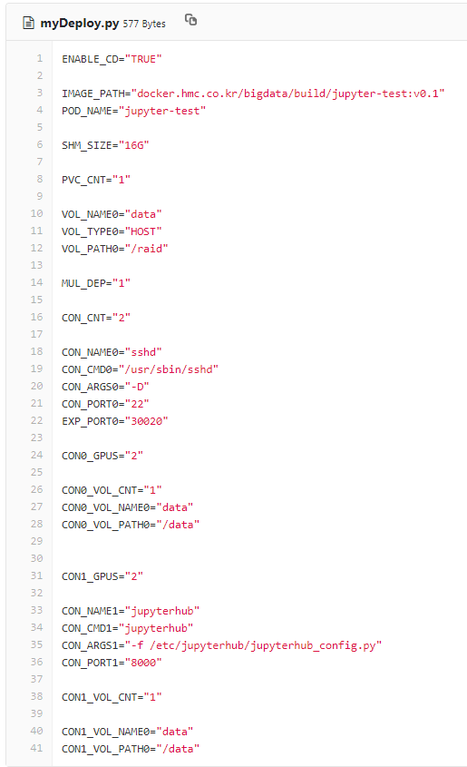
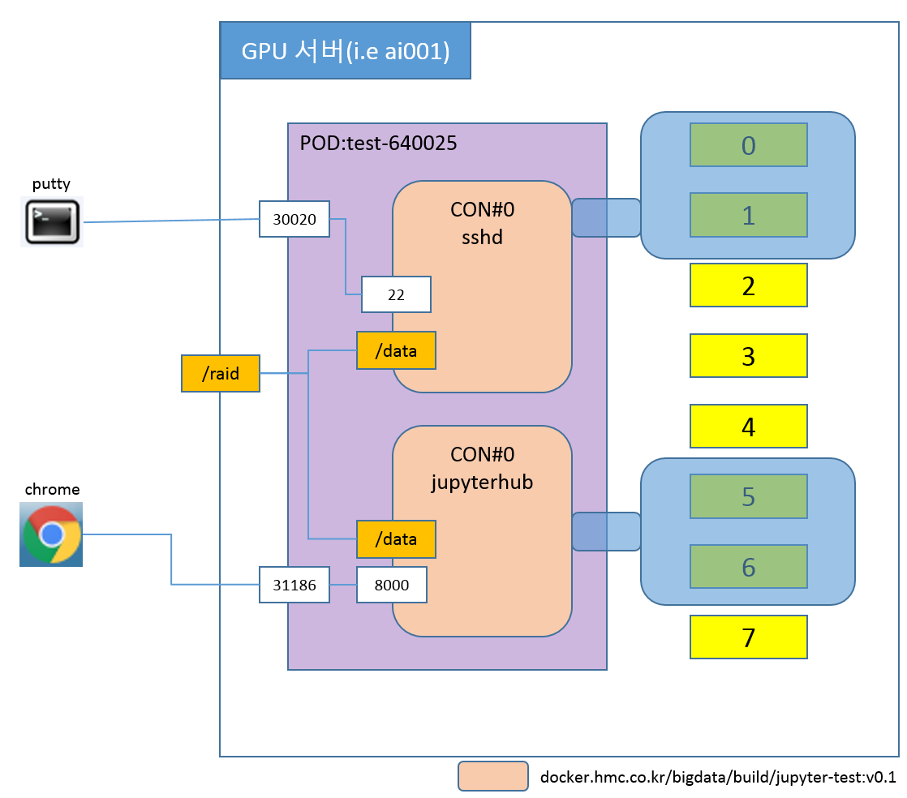
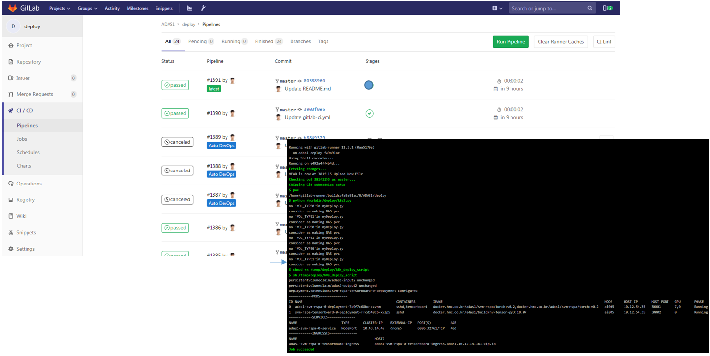
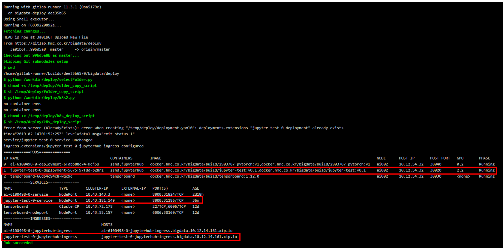
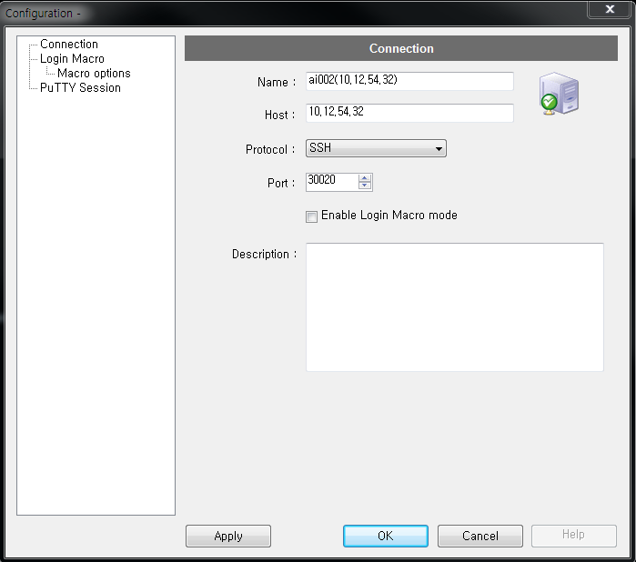
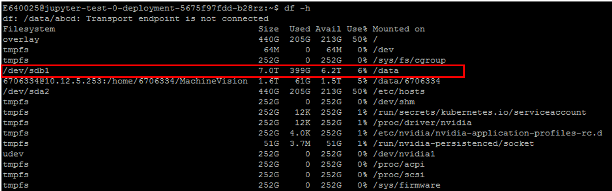
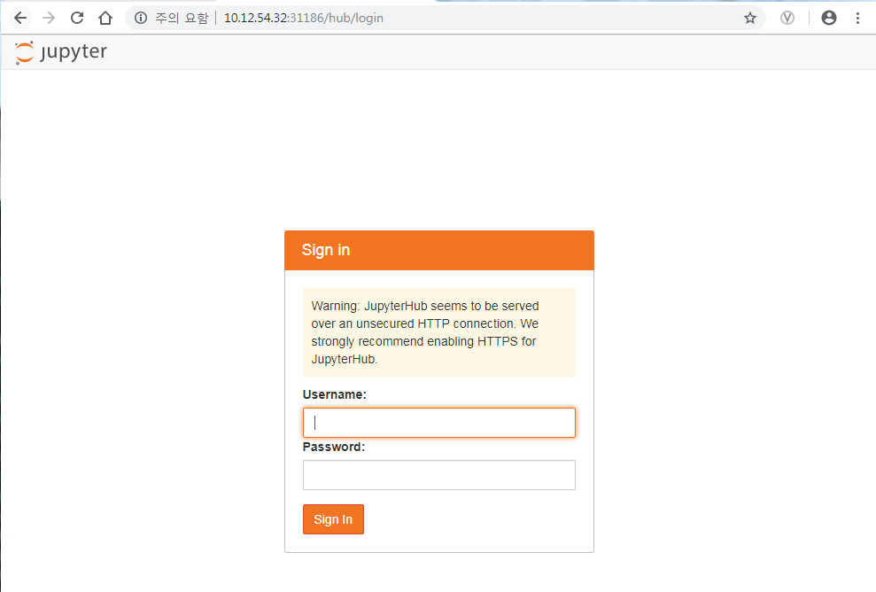

# **1. Project Structure** #


|**Object** | **type** | **설명** |
|:--- |:--- |:--- |
|Deployments |폴더 | |
|&nbsp;└ deploy 이름  |폴더 | GPU 서버에 배포할 내용 |
|&nbsp;&nbsp;└ myDeploy.py |파일 |Docker image를 GPU 서버에 배포하기 위한 설정 파일 |
|.gitlab-ci.yaml  |파일 | 자동화 스크립트 (조작 금지) |
|folder.py  |파일 | GPU 서버에 배포할 정보가 담긴 폴더를 선택하는 파일 |


# **2. How to Deploy** #

<br>Deployments 폴더 하위에 특정한 이름의 폴더를 추가하고,(예. test) <br>
새폴더 안에 myDeploy.py를 작성하여 저장
<br><br>
프로젝트 home에서 folder.py의 FOLDER 속성에 배포할 정보가 담긴 folder(예. test)를 선택
<br><br>

### (1) myDeploy.py 작성 ### 
<br>**IMAGE_PATH**를 배포하고 싶은 Docker image 경로로 지정(예. docker.hmc.co.kr/bigdata/build/jupyter-test:v0.1)<br>
**IMAGE_PATH**에는 https://gitlab.hmc.co.kr/bigdata 그룹 내 저장된 이미지 사용 가능.<br>
<br>지정한 image로 배포된 pod이 가져야할 이름을 **POD_NAME**에 작성<br>
<br>```(주의!!) 같은 이름의 pod이 이미 배포되어 있는 경우 배포 실패함```<br>
<br>myDeploy.py의 상세 spec은 **3. 첨부** 참조<br><br>
<br/>
&nbsp;&nbsp;&nbsp;그림 1.
```
docker.hmc.co.kr/bigdata/build/jupyter-test:v0.1 이미지로 sshd 및 jupyterhub 배포하는 myDeploy.py
```
#

### (2) Container 배포 및 Volume 할당 구조 ###
Gitlab으로 Docker Image를 배포할 수 있는 환경은 Kubernetes로 이루어져 있으며, Volume은 host 디스크와 직접 연결한다<br>
Kubernetes의 주요 Object는 POD, SERVICE, INGRESS, VOLUME이 있으며, **그림 1**에 해당하는 설정으로 Image를 배포할 경우<br>
생성되는 환경의 전체 구조는 아래와 같다.<br><br>
<br/>
&nbsp;&nbsp;&nbsp;그림 2.
```
myDeploy.py에 의해 생성될 Container 환경
```

### (3) 배포 ###
<br>Project 내 파일에 commit이 발생 하면 CI/CD 메뉴에서 이미지 배포 작업이 자동으로 시작됨<br><br>
<br/>
&nbsp;&nbsp;&nbsp;그림 3.
```
deploy project의 repository에 있는 file이 변경 되면 이미지 배포가 자동으로 시작 됨.
CI/CD > Pipeline 메뉴에서 어떤 file이 누구에 의해 업데이트 되었는지 확인할 수 있고 이미지 배포 로그 확인 가능
```
#
### (4) 배포 로그 확인 ###
<br>**myDeploy.py**에 적은 것과 같은 **NAME**을 갖는 **POD**의 **HOST_IP**와 **HOST_PORT**를 확인<br>
Jupyterhub와 같이 웹 브라우저로 접속 가능한 어플리케이션은 **INGRESS**에 생성된 URL 주소로 접속 가능<br><br>
또는, host IP와 **SERVICE**에 확인되는 PORT를 조합하여 접속 가능 (예: http://10.12.54.32:31186 )<br><br>
<br/>
&nbsp;&nbsp;&nbsp;그림 4.
```
예제로 배포된 jupyter-test-0-deployment는 ai002(10.12.54.32) 서버에 생성되었고
30020 port가 컨테이너로 동작중인 sshd의 22번 포트와 연결되어 있고
31186 port가 컨테이너로 동작중인 jupyterhub의 8000번 포트와 연결되어 있음을 확인할 수 있음
```
### (5) Container 접속 및 사용 ###
<br>① 배포 로그에서 확인된 IP와 PORT를 putty와 같은 telnet client로 ssh 접속.<br><br>
<br/>
&nbsp;&nbsp;&nbsp;그림 5.
```
putty에서 ai002(10.12.54.32)를 host로 지정하고, 30020번 port를 입력하여 ssh 접속
```
<br>② 업무 PC 로그인시 사용하는 계정/패스워드로 로그인<br><br>
<br/>
&nbsp;&nbsp;&nbsp;그림 6.
```
putty shell에서 업무 PC 로그인 계정(HKMC AD)으로 로그인 (예. E640025)
```
<br/>
&nbsp;&nbsp;&nbsp;그림 7.
```
putty shell 로그인 후 df -h 명령어로 Container OS에 마운트 된 디스크 목록 확인
myDeploy.py에서 CON0_VOL_PATH0 해당하는 /data 경로로 host의 7.0T 디스크(/raid)가 마운트 되어 있다. 
```
<br>③ 배포 로그에서 확인된 INGRESS URL 또는 host IP와 SERVICE port를 이용해 Jupyterhub 접속<br><br>
<br/>
&nbsp;&nbsp;&nbsp;그림 8.
```
Jupyterhub : http://jupyter-test-0-jupyterhub-ingress.bigdata.10.12.14.161.xip.io
           : http://10.12.54.32:31186
```
#

# **3. 첨부** #

### (1) myDeploy.py Spec ###

|**속성** | **설명** | **예시** |
|:--- |:--- |:--- |
|IMAGE_PATH|배포할image의 경로|docker.hmc.co.kr/bigdata/build/jupyter-test:v0.1|
|POD_NAME|배포될 Container의 이름|jupyter-test|
|SHM_SIZE|64MB 이상의 Share Memory가 필요한 경우|16G|
|PVC_CNT|Container가 사용할 Volume의 개수|1|
|VOL_NAME#|#번째 Volume의 이름<br>생성된 적 없는 Volume인 경우 새로 생성됨|data|
|VOL_TYPE#|#번째 Volume의 Type(NAS or HOST)<br>생략하는 경우 NAS로 간주|HOST|
|VOL_SIZE#|#번째 Volume이 NAS type인 경우 Container에 할당할 Volume의 크기|-|
|VOL_PATH#|#번째 Volume이 HOST type인 경우 Container로 Mount 시킬 host 경로|/raid|
|CON_CNT|실행할 Container의 개수|2|
|CON_NAME#|#번째 Container 이름|sshd|
|CON_CMD#|#번째 Container의 실행 명령어|/usr/sbin/sshd|
|CON_ARG#|#번째 Container의 명령 매개변수|-D|
|CON_PORT#|#번째 Container가 사용할 Port|22|
|EXP_PORT#|#번째 Container가 SSH인 경우 쌍으로 연결할 host의 port<br>Container가 SSHD가 아닌 경우는 생략|30020|
|CON#_GPU|#번째 Container가 사용할 GPU의 개수|2|
|CON#_VOL_CNT|#번째 Container가 사용할 Volume의 개수|1|
|CON#_VOL_NAME$|#번째 Container가 사용할 $번째 Volume의 이름<br>VOL_NAME#에 선언한 이름 중 하나를 사용|data|
|CON#_VOL_PATH$|#번째 Container가 사용할 $번째 Volume의 Mount 경로|/data|